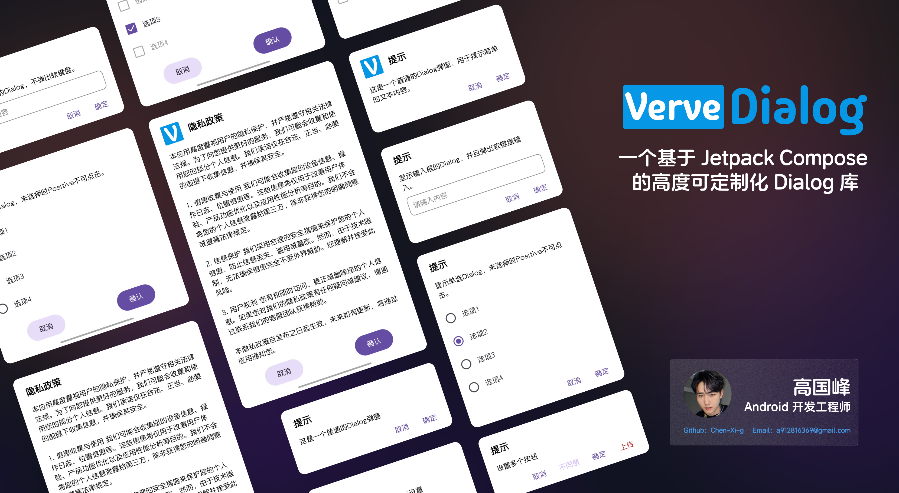

<div align=center>    
  	
</div>
<div align="center">
	
	<h1>适用于Compose的Dialog</h1>
</div>
<p align="center">
	<a href="https://chen-xi-g.github.io/VerveDialog/">使用文档</a>
	| 
	<a href="https://github.com/Chen-Xi-g/VerveDialog/releases">下载Demo</a>
</p>
<p align="center">
  <a href="https://jitpack.io/#Chen-Xi-g/VerveDialog"></a>
  <a href="https://developer.android.com/compose"></a>
  <a href="https://developer.android.com/kotlin?hl=zh-cn"></a>
  <a href="https://github.com/Chen-Xi-g/VerveDialog/blob/main/LICENSE"></a>
</p>

一个基于 Jetpack Compose 的高度可定制化 Dialog 库，适用于 Android 应用。它支持普通对话框和底部对话框（BottomSheet），并提供了多种 UI 组件，用于创建交互式对话框，包括标题、图标标题、消息、输入框、单选、多选列表等。通过全局配置和灵活的 API，您可以轻松调整对话框的样式和功能，以适应您的应用设计需求。

## 特性

- **自定义样式**：支持背景颜色、形状、边框等自定义设置。
- **可配置按钮**：可自定义对话框中的按钮布局。
- **自动关闭**：支持在点击按钮后自动关闭对话框。
- **底部对话框**：支持底部对话框样式，并可自定义拖拽手柄的显示。
- **高扩展性**：支持用户根据不同需求进行扩展使用。

## 安装

**Set 1.** 添加`JitPack`存储库到`Gradle`中。

```kotlin
dependencyResolutionManagement {
    repositories {
        // ...
        maven { url 'https://jitpack.io' }
    }
}
```

**Set 2.** 添加依赖，替换Tag到最新版本。

[](https://jitpack.io/#Chen-Xi-g/VerveDialog)

确保你在项目的 `build.gradle` 文件中添加了 Compose 依赖。

```kotlin
dependencies {
    implementation "com.github.Chen-Xi-g:VerveDialog:Tag"
}
```

## 贡献

欢迎为该项目贡献代码或提出建议。你可以通过 GitHub 提交 issue 或 pull request。

## License

```
MIT License

Copyright (c) 2024 高国峰

Permission is hereby granted, free of charge, to any person obtaining a copy
of this software and associated documentation files (the "Software"), to deal
in the Software without restriction, including without limitation the rights
to use, copy, modify, merge, publish, distribute, sublicense, and/or sell
copies of the Software, and to permit persons to whom the Software is
furnished to do so, subject to the following conditions:

The above copyright notice and this permission notice shall be included in all
copies or substantial portions of the Software.

THE SOFTWARE IS PROVIDED "AS IS", WITHOUT WARRANTY OF ANY KIND, EXPRESS OR
IMPLIED, INCLUDING BUT NOT LIMITED TO THE WARRANTIES OF MERCHANTABILITY,
FITNESS FOR A PARTICULAR PURPOSE AND NONINFRINGEMENT. IN NO EVENT SHALL THE
AUTHORS OR COPYRIGHT HOLDERS BE LIABLE FOR ANY CLAIM, DAMAGES OR OTHER
LIABILITY, WHETHER IN AN ACTION OF CONTRACT, TORT OR OTHERWISE, ARISING FROM,
OUT OF OR IN CONNECTION WITH THE SOFTWARE OR THE USE OR OTHER DEALINGS IN THE
SOFTWARE.
```

